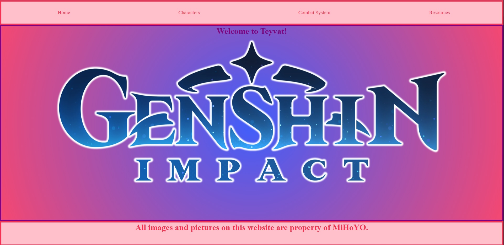
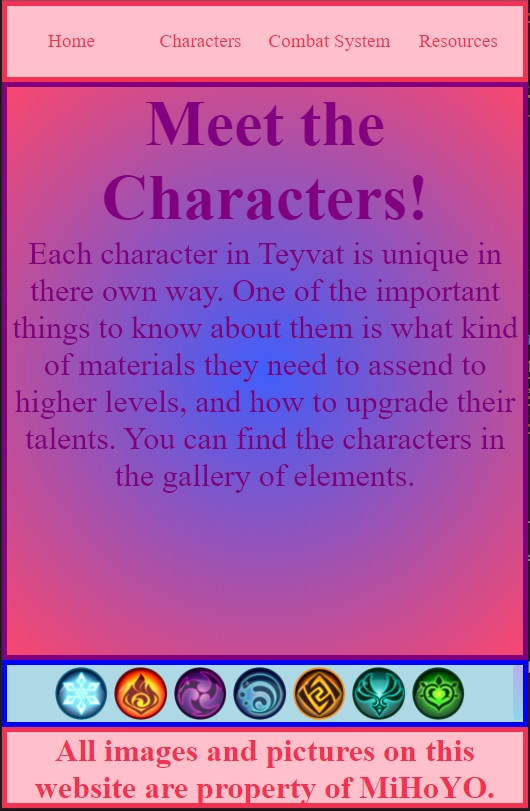
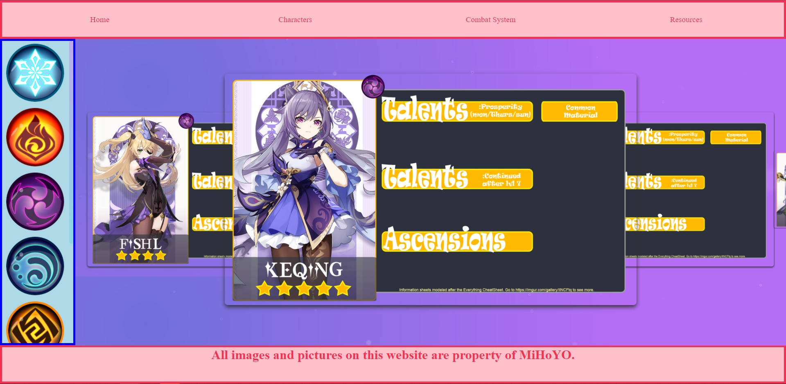

# Genshin_Impact

This website is one of my first projects I started. Im uploading it here so I know where I started. The end goal is to redo and refine the website with my new skills.  
The main things I learned when makeing this website is the use of Flexbox in the layout:  
 

 
particals in the background: 
 

 
the ability to change size when on mobile: 
 

 
and to be able to use a library for a gallery: 
 

 
To see the working model of it please visit the link: 
https://tinet0624.github.io/Genshin_Impact/Main.html
 
I hope to work more on this in the future and flesh it out some more. 
There is still much to improve upon. I look forwad to making it better!
